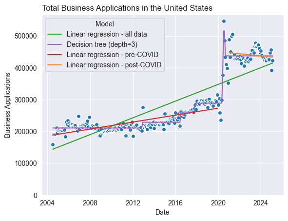

# Did the COVID-19 pandemic have a positive impact on business formations in the United States?

In March 2020 the outbreak of SARS-COV-19 as a pandemic brought global trade to a near stillstand.
Many businesses had to shut down due to distancing regulations or traffic was diminished by it.
But these new regulations also gave opportunity for new business models, like a thriving delivery industry.

In this blog post I will report, how the number of business formations developed before and after the pandemic 
using the business formation statistics from the [United States Census Bureau](https://www.census.gov/econ/bfs/current/index.html).
The dataset contains the number of business applications (adjusted for seasonal variation) in the United States and geographical subregions, sorted by sectors and types of applications. 
The dataset contains numbers from mid-2004 until February 2025.
Here, I will only consider data regarding all types of business applications in the whole United States.

## 1. How did business applications change pre- and post-pandemic?

The total number of business applications seems relatively stable but shows a sudden increase in the year 2020, coinciding with the outbreak of the pandemic.
The raw data shows cyclical behavior within one year. 
That's why the seasonally adjusted data was plotted additionally and will be used for further analysis. 
Since even the adjusted data shows large volatility in the year 2020, the dataset was split in two time ranges to compare pre- and pos-pandemic behavior:
Data before 2020 is considered pre-COVID, and data after 2020 post-COVID.
The data for the year 2020 was omitted in this analysis to take out effects during that re-adjustment phase of the economy directly after the outbreak of the pandemic.

Looking at average monthly applications shows that the numbers approximately doubled after 2020, copmared to the pre-COVID era.

## 2. How did the trend in applications change pre- and post-pandemic?

The trend in the data was modeled using linear regression. 
From the plot it can be seen that the number of applications had an increasing trend before the pandemic but has a decreasing trend since 2021.
This shows that data from pre-pandemic times seems not well suited to predict currents trends in 

## 3. Predicting future application numbers

The future number of business applications is very interesting to know for governments for budget planning.
Using the existing data, I fitted 4 different models to the data to make future predictions:
Three linear regression models - on all datapoints, only pre-pandemic, and only post-pandemic - and a decision tree.
I used the models to predict the number of applications in January 2026. 
Interestingly, the linear regression models for all data and post-COVID, and the decision tree all predicted approx. 430k application.
The linear regression on the pre-COVID data predicted 307k applications.
This discrepancy further highlights that the pre-pandemic data might not be wll suited to predict business applications in the close future,
but only the true data will tell who was closest!

## Conclusions

In this article, we looked into the number of business application in the United States before and after the COVID-19 pandemic.

1. The number of monthly applications doubled after the pandemic.
2. The numbers were increasing before the pandemic but are decreasing now.
3. The trends before the pandemic are not well suited to predict trends in the close future.

The results here are mainly observational and limited to only one measured feature. 
The question remains: What caused the surge in business applications in 2020?
What other features exist that correlate with this data and what are causative parameters to explain the trends observed here?

You can find more about this analysis on my Github [here](https://github.com/felix-r/udacity_intro_data_sci_project).